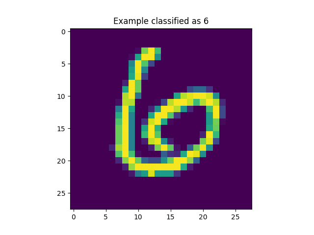
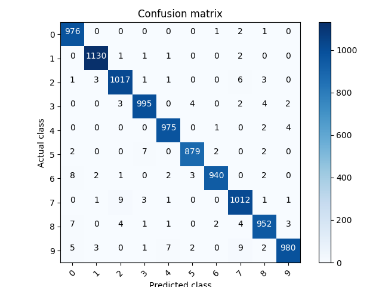

## Lab 7: Case study with Keras

authors: Arias Rodrigo, Burca Horia

date: 22/11/2018

In order to run keras in Marenostrum, we first need to load some modules. The
script `load-modules` contains the needed modules, depending on the cluster:

	#!/bin/bash

	if [ $(hostname) == 'p9login1' ]; then
		module load cudnn/7.1.3 atlas/3.10.3 scalapack/2.0.2 fftw/3.3.7 \
			szip/2.1.1 opencv/3.4.1 python/3.6.5_ML
	else
		module load gcc/7.2.0 impi/2018.1 mkl/2018.1 python/3.6.4_ML
	fi

Load the required modules by running:

	$ . load-modules

To run, use python3:

	$ python3 xx.py

### Loading the dataset

The `mnist` dataset was manually placed in the Marenostrum cluster, and then
loaded in keras. The file `train.py` trains the model and saves the state to
disk.

First we load the dataset:

	#!/usr/bin/env python
	# coding: utf-8

	from keras.datasets import mnist
	from keras.layers import *
	from keras.models import *
	from keras.utils import to_categorical

	# Save the files manually in ~/.keras/datasets/ as MN cannot download from
	# Internet
	(x_train, y_train), (x_test, y_test) = mnist.load_data()

	x_train = x_train.astype('float32') / 255
	x_test = x_test.astype('float32') / 255

	# print(x_test.shape)
	# (10000, 28, 28)

	x_train = x_train.reshape(60000, 28, 28, 1)
	x_test = x_test.reshape(10000, 28, 28, 1)

	y_train = to_categorical(y_train, num_classes=10)
	y_test = to_categorical(y_test, num_classes=10)

To build the model, we use the Sequencial class:

	# Build the model

	model = Sequential()
	model.add(Conv2D(32, (5, 5), activation='relu', input_shape=(28, 28, 1)))
	model.add(MaxPooling2D((2, 2)))
	model.add(Flatten())
	model.add(Dense(10, activation='softmax'))

	model.summary()

And then we train the model:

	batch_size = 50
	num_classes = 10
	epochs=50

	model.compile(loss='categorical_crossentropy',
				  optimizer='sgd',
				  metrics=['accuracy'])

	model.fit(x_train, y_train,
			  batch_size=batch_size,
			  epochs=epochs,
			  verbose=1)

	test_loss, test_acc = model.evaluate(x_test, y_test)

	print('Test loss:', test_loss)
	print('Test accuracy:', test_acc)

Finally, the model is saved to disk, with the weights:

	#Serialize model to JSON
	model_json = model.to_json()
	with open("model.json", "w") as f:
		f.write(model_json)
	# serialize weights to HDF5
	model.save_weights("model.h5")
	print("Saved model to disk")

## Prediction and evaluation

After training the model, we load again the dataset:

	#!/usr/bin/env python
	# coding: utf-8

	import keras
	import matplotlib
	matplotlib.use('Agg')
	import matplotlib.pyplot as plt
	import numpy as np
	from numpy import linalg
	from keras.datasets import mnist
	from keras.layers import *
	from keras.models import *
	from keras.optimizers import sgd
	from keras.utils import to_categorical

	(x_train, y_train), (x_test, y_test) = mnist.load_data()

	x_train = x_train.astype('float32') / 255
	x_test = x_test.astype('float32') / 255

	# print(x_test.shape)
	# (10000, 28, 28)

	x_train = x_train.reshape(60000, 28, 28, 1)
	x_test = x_test.reshape(10000, 28, 28, 1)

	y_train = to_categorical(y_train, num_classes=10)
	y_test = to_categorical(y_test, num_classes=10)

Then we load the trained model:

	# load json and create model
	json_file = open('model.json', 'r')
	model_json = json_file.read()
	json_file.close()
	model = model_from_json(model_json)
	# load weights into new model
	model.load_weights("model.h5")
	print("Loaded model from disk")

And evaluate the accuracy:

	# evaluate loaded model on test data
	model.compile(loss='categorical_crossentropy',
				  optimizer='sgd',
				  metrics=['accuracy'])

	test_loss, test_acc = model.evaluate(x_test, y_test)

	print('Test loss:', test_loss)
	print('Test accuracy:', test_acc)

Which surpasses the provided model:

	Test loss: 0.04247535159343388
	Test accuracy: 0.9859

And an example is tested

	# Predictions

	i = 11
	predictions = model.predict(x_test)
	tag = np.argmax(predictions[i])

	test_sel = x_test[i]
	img = test_sel.reshape(28, 28)
	plt.imshow(img)
	plt.title("Example classified as {}".format(tag))
	plt.savefig("test.png")
	plt.close()

Which is correctly classified:

Finally, the confusion matrix is plotted as well:

	# Look at confusion matrix 
	# Note, this code is taken straight from the SKLEARN website, an nice way of
	# viewing confusion matrix.

	def plot_confusion_matrix(cm, classes,
							  normalize=False,
							  title='Confusion matrix',
							  cmap=plt.cm.Blues):
		"""
		This function prints and plots the confusion matrix.
		Normalization can be applied by setting `normalize=True`.
		"""
		plt.imshow(cm, interpolation='nearest', cmap=cmap)
		plt.title(title)
		plt.colorbar()
		tick_marks = np.arange(len(classes))
		plt.xticks(tick_marks, classes, rotation=45)
		plt.yticks(tick_marks, classes)

		if normalize:
			cm = cm.astype('float') / cm.sum(axis=1)[:, np.newaxis]

		thresh = cm.max() / 2.
		for i, j in itertools.product(range(cm.shape[0]), range(cm.shape[1])):
			plt.text(j, i, cm[i, j],
					 horizontalalignment="center",
					 color="white" if cm[i, j] > thresh else "black")

		plt.tight_layout()
		plt.ylabel('Actual class')
		plt.xlabel('Predicted class')

	from collections import Counter
	from sklearn.metrics import confusion_matrix
	import itertools

	# Predict the values from the validation dataset
	Y_pred = model.predict(x_test)
	# Convert predictions classes to one hot vectors
	Y_pred_classes = np.argmax(Y_pred, axis = 1)
	# Convert validation observations to one hot vectors
	Y_true = np.argmax(y_test, axis = 1)
	# compute the confusion matrix
	confusion_mtx = confusion_matrix(Y_true, Y_pred_classes)
	# plot the confusion matrix
	plot_confusion_matrix(confusion_mtx, classes = range(10))
	plt.savefig("plot.png")

