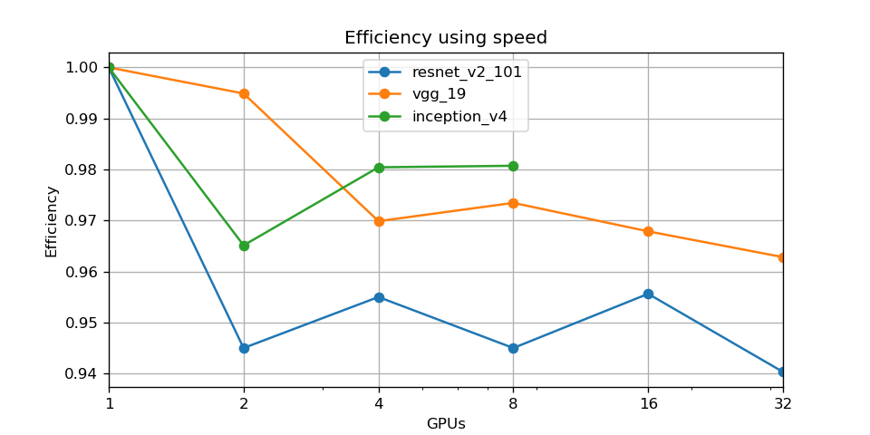
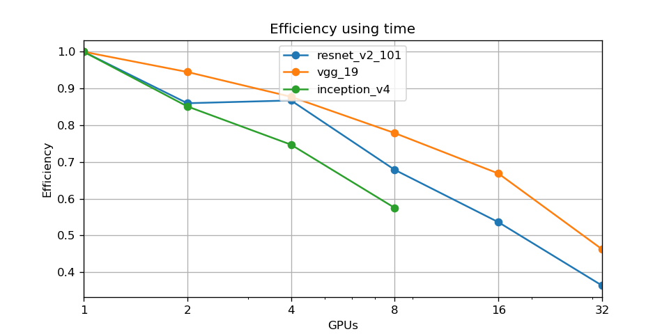

HackSA: Performance of VGG, Inception and ResNet with Horovod
-------------------------------------------------------------

*Authors: Arias Rodrigo, Burca Horia*

*Date: 14/01/2019*

Continuing the analysis with Horovod and the CIFAR10 dataset, we now focus on
the performance of the models: VGG, Inception and ResNet

### Performance metrics

As previously stated in lab 11, we use 2 metrics to evaluate the overall
performance. The speed of the training process, measured in the average number
of samples per second. And the time it takes the complete training, skipping the
initialization time.

With that information, the speedup is computed as:

	speedup_speed = gpus * speed_parallel / speed_serial
	speedup_time = time_serial / time_parallel

### Speedup

The speedup measured using both metrics (time and speed), and shown as the
number of GPUS grow, in the three models:

### Efficiency

The efficiency is the computed for each model, and plot using the two speedup metrics:

### Conclusions

The measurement produced by the `average_example_per_sec` hooks in TensorFlow,
leads to different time, compared with the wall time of the train process. We
assume that the difference is due to overheads, such as the initialization or
communication time.

A more in depth analysis could provide a better explanation on why such
differences are observed, and which metric is more reliable to represent the
speedup of the training process.
